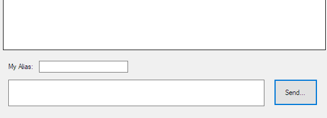

# DB-Chat-Application

**Funktion:**

<p align="center">Display GUI; get User Input; send User Input to DB:</p>

<p align="center">
  
</p>

## How to communicate with a DB

**DB Access**

```
MySqlConnection myConnection = new MySqlConnection("SERVER=localhost;DATABASE=XXXX;UID=root;PASSWORD=;");
myConnection.Open();
```

**Connect to DB**

```
myCommand.Connection = myConnection;
```

**Creat SQL Command**

```
string myInsertQuery = "INSERT INTO t_chatquote (timestamp) Values('DateTime.Now.ToString("yyyy-MM-dd HH:mm")')";
MySqlCommand myCommand = new MySqlCommand(myInsertQuery);
```

**Send SQL Command**

```
myCommand.ExecuteNonQuery();
```

**Close DB Access**

```
myConnection.Close();
```

## Where you can find more Stuff about me:

[Sei's Homepage](https://sei-vae.github.io/)
